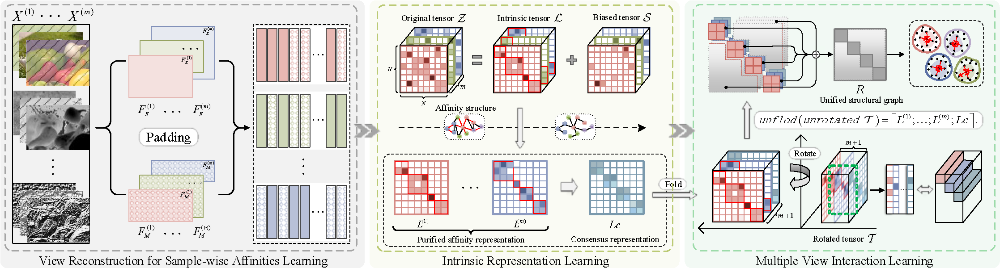

# IJCAI-2025-Consensus-Guided Incomplete Multi-view Clustering via Cross-view Affinities Learning (CAL)

### [Paper]()
This repository is the official matlab implementation for the paper "Consensus-Guided Incomplete Multi-view Clustering via Cross-view Affinities Learning" by Qian Liu (lq0307@dlmu.edu.cn), Huibing Wang (huibing.wang@dlmu.edu.cn), Jinjia Peng, Yawei Chen, Mingze Yao, Xianping Fu, Yang Wang. Proceedings of the Thirty-Fourth International Joint Conference on Artificial Intelligence, IJCAI-25.

## Introduction
In this paper, we propose a novel Consensus-Guided Incomplete Multi-view Clustering via Cross-view Affinities Learning (CAL). Specifically, CAL reconstructs views with available instances to mine sample-wise affinities and harness comprehensive content information within views. Subsequently, to extract clean structural information, CAL imposes a structured sparse constraint on the representation tensor to eliminate biased errors. Furthermore, by integrating the consensus representation into a tensor stacked by view-specific affinity representations, CAL employs high-order interaction of multiple views to depict the semantic correlation between views while learning a unified structural graph across multiple views. Extensive experiments on several benchmark datasets demonstrate that CAL outperforms some state-of-the-art methods in clustering performance.



## Dependencies
* OS: Windows 10
* Matlab2020b
* Related measure can be obtained in `.\tools`.

## Data Preparation
+ To generate the incomplete views, we randomly remove 10\%, 30\%, 50\% and 70% samples of each view and at least preserve one view existing.
+ For instance, we have provided the BBCSport dataset with a 10% missing data rate and the MSRC dataset with a 50% missing data rate in `.\datasets`, and the `DataPreparing.m` file is provided for data preparation.

## Usage
+ Conduct clustering
  run `demoBBCSport.m` and `demoMSRC.m`. The relevant hyperparameter settings have been provided in the code.

##  Citation
If any part of our paper and repository is helpful to your work, please generously cite with:

```
@article{Liu2025CAL,
      title={Consensus-Guided Incomplete Multi-view Clustering via Cross-view Affinities Learning}, 
      author={Qian Liu, Huibing Wang, Jinjia Peng, Yawei Chen, Mingze Yao, Xianping Fu, Yang Wang},
      booktitle = {Proceedings of the Thirty-Third International Joint Conference on
               Artificial Intelligence, {IJCAI-25}},
      publisher = {International Joint Conferences on Artificial Intelligence Organization},
      year={2025}
}
```
